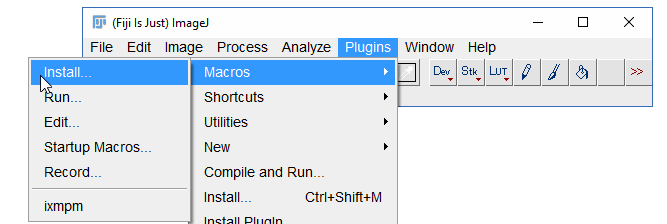

# ixmpm
## GUI-based macro to make IXM plates montages

##Installation

To install the gui-based macro: 

1. Download ixmtimelapse.ijm

2. Go to Plugins -> Macros -> Install

3. Point Fiji/ImageJ to the location of the downloaded

## Operations instructions

More help text coming soon...